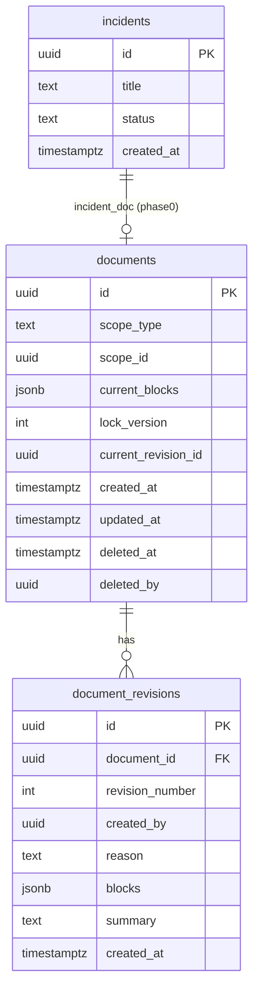
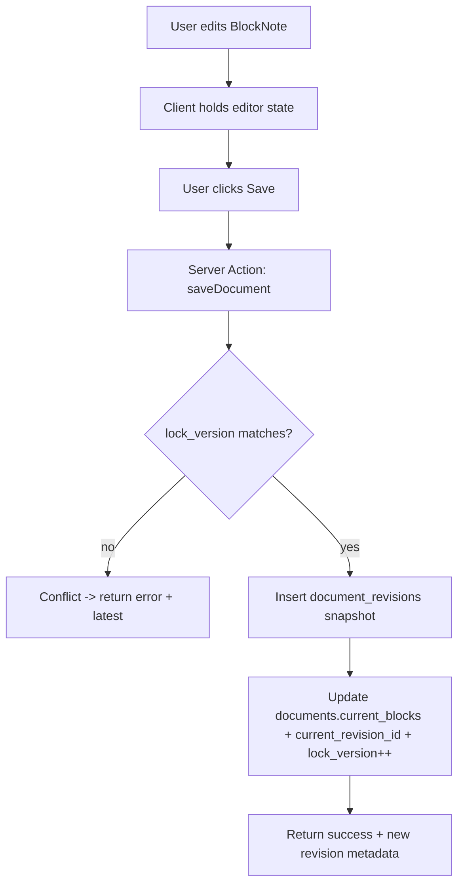
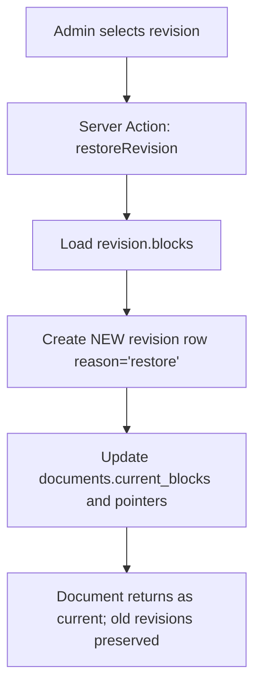

# Infra Lumen Deep Research Report  
## BlockNote (blocknotejs.org) and Vercel AI SDK (ai-sdk.dev) for Next.js App Router, shadcn/ui, revisions, autosave, and AI-assisted drafting

## Executive summary

Infra Lumen’s Phase 0 can be implemented reliably by treating **BlockNote JSON as the canonical document format** and layering **revision-safe persistence** plus an **AI pipeline that never asks the model to emit BlockNote JSON directly**.

BlockNote’s own documentation explicitly recommends storing **BlockNote JSON (`editor.document`)** because it is “the most durable format & guaranteed to be lossless,” and it provides canonical patterns for saving via `editor.onChange` / `useEditorChange` and loading via `initialContent`. citeturn25view0turn2view0turn24view0 This maps cleanly to a Postgres `jsonb` column (Supabase) and a `documents` / `document_revisions` schema.

For UI, BlockNote’s **ShadCN integration** (`@blocknote/shadcn`) is designed for Tailwind/shadcn projects and requires Tailwind to include BlockNote’s utility classes via an `@source` directive; it also supports swapping in your project’s shadcn components via `shadCNComponents`, with an important compatibility note: your shadcn DropdownMenu/Popover/Select **should not use Portals**. citeturn16view0turn8view0turn4view0

For AI, Vercel AI SDK provides a strongly-typed approach to structured extraction using `generateText` + `output: Output.object({ schema: zodSchema })`, and it documents tool calling and multi-step loops controlled by `stopWhen: stepCountIs(n)`. citeturn22view0turn10view2turn13view1turn10view4 The key implementation insight for Infra Lumen is to use the model to produce a **small intermediate schema** (validated by Zod), then pass that object into a **deterministic “BlockNote composer”** in your codebase to create the final BlockNote blocks. This satisfies your requirement to avoid “raw chat JSON” and enables later diff/restore tooling.

Recommended Phase 0 approach:

- **Data:** Postgres/Supabase `documents` table holds current state + soft-delete; `document_revisions` stores immutable snapshots plus metadata and optional “change summaries.”  
- **Saving:** Manual Save creates a new revision snapshot; optional debounced autosave updates current draft without creating excessive revisions.  
- **Concurrency:** Optimistic concurrency with `lock_version` (portable) and optional `xmin` (Postgres-specific) examples.  
- **AI Create / AI Structure:** `generateText` → validated intermediate object → deterministic composer → (draft preview) → Accept creates a revision / Reject discards.

## BlockNote deep research for Infra Lumen

### Next.js integration constraints and component architecture

BlockNote is explicitly **client-only** in Next.js contexts; the BlockNote docs call out that you must disable SSR for BlockNote in Next.js or other server-rendered React frameworks. citeturn7search22 This requirement aligns with Next.js App Router’s split between Server Components and Client Components (the App Router is built on Server Components and Server Functions). citeturn14view0

Practical pattern for Infra Lumen:

- Keep the route/page as a **Server Component** that fetches the document JSON (from Supabase) and passes it to a **Client Component** that renders BlockNote.
- The editor component must have `"use client"` and should not import BlockNote in a server context.

BlockNoteView is an **uncontrolled component**, meaning you don’t pass editor content as a prop and “control” it like a `<textarea>`; you set initial content via `initialContent` and then interact via the editor API + event hooks. citeturn8view5turn25view0 This has concrete implications for your Accept/Reject preview UX: to swap in a new document state, you either (a) recreate the editor with new `initialContent` (e.g., keyed remount), or (b) call editor APIs like `replaceBlocks`. BlockNote documents `replaceBlocks(blocksToRemove, blocksToInsert)` as the canonical way to swap content programmatically. citeturn17view0turn25view0

### BlockNote JSON schema, block types, and serialization rules

BlockNote’s **native document is a list/array of blocks**, where each block has:

- `id: string`
- `type: string`
- `props: Record<string, boolean | number | string>`
- `content: InlineContent[] | TableContent | undefined`
- `children: Block[]` citeturn2view0

BlockNote states that block IDs are stable for the life of a block: a block “will keep the same ID from when it’s created until it’s removed,” and IDs must be unique. citeturn2view0 This matters for future diffing: stable IDs can help correlate unchanged blocks, but AI structure operations that replace the whole document will often generate new IDs (unless you deliberately preserve them). In Phase 0, favor correctness and reliability over ID preservation; treat IDs as implementation details and compute diffs structurally / textually later.

Inline content is represented as `InlineContent` objects, including:

- `StyledText` (`{ type: "text", text: string, styles: Styles }`)
- `Link` (`{ type: "link", content: StyledText[], href: string }`)
- and optional custom inline types. citeturn2view0turn8view6

BlockNote’s docs provide a clear directive for durable persistence: export the built-in Block format using `JSON.stringify(editor.document)` for non-lossy storage. citeturn2view2turn25view0

Built-in/default block types (with examples in the official “Default Schema Showcase”) include: `paragraph`, `heading`, `quote`, `bulletListItem`, `numberedListItem`, `checkListItem`, `toggleListItem`, `codeBlock`, `table`, `file`, `image`, `video`, `audio`. citeturn6view0turn6view2

List blocks also have documented type/props definitions:

- `bulletListItem`: `type: "bulletListItem"`, `props: DefaultProps`  
- `numberedListItem`: `type: "numberedListItem"`, `props` includes optional `start?: number`  
- `checkListItem`: `type: "checkListItem"`, `props` includes `checked: boolean`  
- `toggleListItem`: `type: "toggleListItem"` citeturn6view1

### Theming and styling with Tailwind + shadcn/ui

Infra Lumen’s target stack (Next.js + Tailwind + shadcn/ui) aligns well with BlockNote’s ShadCN renderer (`@blocknote/shadcn`). The BlockNote ShadCN guide specifies:

- Install: `@blocknote/core @blocknote/react @blocknote/shadcn`
- Import `BlockNoteView` from `@blocknote/shadcn` and include `@blocknote/shadcn/style.css`
- Ensure Tailwind picks up BlockNote’s utility classes by adding an `@source "../node_modules/@blocknote/shadcn"` directive to your Tailwind stylesheet. citeturn16view0

BlockNote also supports using your **project’s own shadcn components** via the `shadCNComponents` prop, listing which component modules can be overridden (e.g., Button, Select, Popover, DropdownMenu, etc.). citeturn16view0

Important shadcn compatibility caveat: your shadcn DropdownMenu, Popover and Select components **should not use Portals** (BlockNote recommends commenting them out). citeturn16view0turn8view0 This is a common friction point; plan to maintain “BlockNote-safe” variants of those components.

On the shadcn side, the official shadcn/ui theming approach strongly centers on **CSS variables** (recommended) and Tailwind integration (`tailwind.cssVariables: true` in `components.json`). citeturn15view0 This pairs nicely with BlockNote’s theming model, which is also based on CSS variables/themes and supports overriding CSS variables or providing a theme object passed via the `theme` prop (depending on the UI package). citeturn8view2turn4view1turn4view2

### Persistence patterns, autosave, and concurrency implications

BlockNote’s docs recommend using `editor.onChange` (vanilla) or `useEditorChange` (React) for capturing the latest content; the hook is called every time content changes. citeturn25view0turn24view0turn21view0 The official “Saving & Loading” example shows saving `editor.document` and notes you may want to debounce or replace local storage calls with backend storage. citeturn4view3

BlockNote provides (and documents) detailed change information via `getChanges()` in `onChange`, including insert/update/delete/move changes and sources like `local`, `paste`, `undo`, `redo`, `yjs-remote`, etc. citeturn21view0turn24view0 This is significant for Infra Lumen:

- Phase 0: simplest, safest: snapshot storage + revision rows.
- Future: you can leverage `getChanges()` to create a **change log**, compute a diff view, or store a compact delta stream—but delta systems add complexity and are risky unless carefully validated.

## Vercel AI SDK deep research for Infra Lumen

### Core primitives for deterministic structured data

AI SDK Core recommends `generateText` and `streamText` as foundational functions, and states advanced features like tool calling and structured data generation are built on top of text generation. citeturn10view3turn10view4

For structured outputs, AI SDK standardizes object generation across providers using the `output` property on `generateText`/`streamText`, and explicitly warns that you must provide schemas and validate because “LLMs can produce incorrect or incomplete structured data.” citeturn22view0turn10view2 The primary mechanism is:

- `output: Output.object({ schema: z.object({ ... }) })`  
- The SDK validates the result against the schema for complete (non-streamed) outputs. citeturn10view2turn22view0

AI SDK documentation also states that the older `generateObject()` function is deprecated in favor of `generateText` with the `output` property. citeturn11view0

For Infra Lumen’s “AI must not emit BlockNote JSON,” this structured output mechanism is ideal: use it to generate an **intermediate, stable, small schema**, then deterministically compose BlockNote blocks in your own code.

### Tool calling, multi-step flows, and step accounting

AI SDK provides a `tool()` helper that ties `inputSchema` to the `execute` method for proper TS inference. citeturn13view0 It also provides `stopWhen: stepCountIs(n)` to control multi-step tool loops. citeturn13view1turn19search34

A key gotcha is documented by AI SDK: **structured output generation counts as a step** in the multi-turn execution model, so when combining tool calling + structured output, you must account for the extra step in `stopWhen`. citeturn22view0turn19search12 This matters if you implement a compound flow like:

1) Model generates intermediate structured object  
2) Model calls a tool (optional)  
3) Model generates a final narrative response

In many Infra Lumen cases, you can avoid multi-step tool loops entirely by doing:
- one `generateText` call producing the validated intermediate object
- composing blocks deterministically (no tool call needed)
- returning blocks to the client

### Provider selection, local endpoints, and structured outputs support

AI SDK’s “Choosing a Provider” guide states it supports “first-party,” “OpenAI-compatible,” and “community” packages. citeturn20view1 For Infra Lumen, local or self-hosted model serving is practical via the OpenAI-compatible provider package, which is configured with `createOpenAICompatible({ name, apiKey, baseURL, ... })`. citeturn10view5turn1view8

For OpenAI-compatible providers, the docs list advanced options including:

- `baseURL` for request URL prefix
- `headers` for custom headers
- `includeUsage: true` to include usage info in streaming responses
- `supportsStructuredOutputs: boolean` to indicate structured output support (relevant to `provider()`/models) citeturn10view5turn1view8

This directly maps to Infra Lumen’s “local LLM endpoints” requirement: you can point `baseURL` at an internal OpenAI-compatible gateway (LM Studio, llama-server, etc.) and turn on `supportsStructuredOutputs` if the backend truly supports schema-constrained output.

### Error handling, retries, and deterministic settings

AI SDK error handling guidance:

- Regular errors can be caught via `try/catch` around `generateText` calls. citeturn10view1
- For streaming, AI SDK provides `onError`, `onAbort`, and stream “parts” handling patterns. citeturn22view0turn10view1

For determinism, the Settings doc explains `temperature` (0 is “almost deterministic” for most providers), `maxRetries`, and that in AI SDK 5+, temperature is no longer defaulted to 0. citeturn20view0 For deterministic extraction in Infra Lumen, you should explicitly set low temperature (often 0–0.2), set bounded `maxOutputTokens`, and use `maxRetries` for transient provider failures.

### Why this fits the “LLM → intermediate schema → deterministic composer” requirement

Your requirement mirrors the general best practice that structured schemas should be produced using structured-output mechanisms (function calling / schema outputs), and tool calling should be used to integrate with system functionality. OpenAI’s Structured Outputs guide similarly distinguishes between structured outputs for tool/function calling vs structured response formats, and notes structured outputs ensure schema adherence (as opposed to JSON mode). citeturn20view2

In Infra Lumen, we translate that into:

- Don’t ask the model to “guess” BlockNote JSON
- Ask the model for a constrained intermediate structure (Zod validated)
- Deterministically generate the BlockNote JSON blocks from that structure
- Store blocks as snapshots in Postgres with revision history

## Recommended Infra Lumen architecture

### Revision strategy comparison

| Strategy | What is stored | Pros | Cons | Phase 0 fit |
|---|---|---|---|---|
| Snapshot revisions (recommended) | Full BlockNote JSON snapshot per revision | Simple; reliable; easy restore and audit; aligns with BlockNote’s “JSON is lossless” recommendation citeturn25view0turn2view2 | More storage; diffs require computation | Excellent |
| Delta revisions (BlockNote `getChanges`) | Store per-change deltas from BlockNote events (`getChanges`) citeturn21view0 | Potentially smaller; easier “activity feed” | Harder to restore; must handle edge cases; requires robust replay | Later enhancement |
| Hybrid | Snapshots + deltas | Best of both worlds | More moving parts | Good long-term |

**Recommendation:** Use **Snapshot + metadata**, with optional “change summary” fields derived from `getChanges()` if you want audit-friendly data without relying on deltas for reconstruction. This is consistent with BlockNote’s persistence guidance and easier to implement safely. citeturn25view0turn21view0

### Postgres schema proposal (Drizzle + Supabase)

Below is a practical schema for Infra Lumen that supports:

- current document content
- immutable revisions
- soft delete / trash
- optimistic concurrency (`lock_version`)
- restore-by-copy (new revision created on restore)

#### Mermaid ER diagram



#### Drizzle table definitions (TypeScript)

```ts
// db/schema/documents.ts
import { pgTable, uuid, text, jsonb, integer, timestamp, index, uniqueIndex } from "drizzle-orm/pg-core";

export const documents = pgTable(
  "documents",
  {
    id: uuid("id").primaryKey().defaultRandom(),

    // Generic attachment point:
    // scope_type: "incident" | "system" | "kb" | ...
    scopeType: text("scope_type").notNull(),
    scopeId: uuid("scope_id").notNull(),

    currentBlocks: jsonb("current_blocks").notNull(), // BlockNote blocks JSON
    currentRevisionId: uuid("current_revision_id"),   // points to document_revisions.id (nullable initially)

    lockVersion: integer("lock_version").notNull().default(0),

    createdAt: timestamp("created_at", { withTimezone: true }).notNull().defaultNow(),
    updatedAt: timestamp("updated_at", { withTimezone: true }).notNull().defaultNow(),

    deletedAt: timestamp("deleted_at", { withTimezone: true }),
    deletedBy: uuid("deleted_by"),
  },
  (t) => ({
    scopeIdx: index("documents_scope_idx").on(t.scopeType, t.scopeId),
    deletedIdx: index("documents_deleted_idx").on(t.deletedAt),
  })
);

export const documentRevisions = pgTable(
  "document_revisions",
  {
    id: uuid("id").primaryKey().defaultRandom(),
    documentId: uuid("document_id").notNull(), // add FK in SQL migration (Supabase) if desired

    revisionNumber: integer("revision_number").notNull(), // per-document increment
    createdBy: uuid("created_by"),
    reason: text("reason").notNull().default("manual_save"),

    blocks: jsonb("blocks").notNull(), // immutable snapshot

    // Optional: store an audit-friendly text summary for admin UI / diff lists
    summary: text("summary"),

    createdAt: timestamp("created_at", { withTimezone: true }).notNull().defaultNow(),
  },
  (t) => ({
    docRevUnique: uniqueIndex("doc_rev_unique").on(t.documentId, t.revisionNumber),
    docCreatedIdx: index("doc_rev_created_idx").on(t.documentId, t.createdAt),
  })
);
```

#### Supabase migration notes

Supabase is Postgres, so `jsonb`, partial indexes, triggers, and FK constraints are available. A pragmatic migration plan:

- Create tables via SQL migrations (or Drizzle migrations if you run them against Supabase).
- Add FK constraints for `document_revisions.document_id → documents.id` and optionally `documents.current_revision_id → document_revisions.id`.
- Use RLS policies consistent with your role model; keep these tables protected since they may contain operational data.

### Save, autosave, restore, and soft-delete flows

#### Save flow (manual Save creates a revision)



#### Restore flow (copy-on-restore)



#### Soft delete / trash

- `deleted_at` and `deleted_by` on `documents` (and separately on incidents if needed).
- Standard UI hides deleted docs by default; an Admin “Trash” view queries `deleted_at IS NOT NULL`.

## Concrete integration patterns and code-ready snippets

### BlockNote embedding in Next.js App Router with shadcn/ui

#### Client editor component

```tsx
// app/(app)/documents/[id]/DocumentEditor.tsx
"use client";

import "@blocknote/core/fonts/inter.css";
import "@blocknote/shadcn/style.css";

import { useCreateBlockNote } from "@blocknote/react";
import { BlockNoteView } from "@blocknote/shadcn";
import type { Block } from "@blocknote/core";

export function DocumentEditor({
  initialBlocks,
  editable,
  onChangeBlocks,
}: {
  initialBlocks: Block[];
  editable: boolean;
  onChangeBlocks?: (blocks: Block[]) => void;
}) {
  // BlockNoteView is uncontrolled; set initial content once. citeturn8view5turn25view0
  const editor = useCreateBlockNote({ initialContent: initialBlocks });

  return (
    <BlockNoteView
      editor={editor}
      editable={editable} // documented prop citeturn8view5
      onChange={() => {
        onChangeBlocks?.(editor.document); // editor.document is canonical JSON citeturn25view0turn8view6
      }}
      // Optionally pass your shadcn modules:
      // shadCNComponents={{ Button, Select, Popover, ... }}
    />
  );
}
```

#### Tailwind setup required by BlockNote ShadCN

In your Tailwind entry CSS (per BlockNote docs), include the `@source` directive so Tailwind generates required utilities for the BlockNote ShadCN package. citeturn16view0

```css
@import "tailwindcss";
/* ... */

/* Path to your installed @blocknote/shadcn package: */
@source "../node_modules/@blocknote/shadcn";
```

If you pass your own shadcn components via `shadCNComponents`, ensure the relevant components do not use Portals (DropdownMenu/Popover/Select) as warned by BlockNote. citeturn16view0turn8view0

### Autosave and concurrency patterns

#### Debounced autosave (update document draft, no new revision)

BlockNote docs show saving on every change and advise debouncing if needed. citeturn4view3turn25view0

```ts
// lib/autosave.ts
export function debounce<T extends (...args: any[]) => void>(fn: T, ms: number): T {
  let t: ReturnType<typeof setTimeout> | undefined;
  return ((...args: any[]) => {
    if (t) clearTimeout(t);
    t = setTimeout(() => fn(...args), ms);
  }) as T;
}
```

```tsx
// In DocumentEditor usage:
const debouncedSave = useMemo(
  () =>
    debounce((blocks: Block[]) => {
      // call server action updateDraftAction({documentId, blocks, expectedLockVersion})
    }, 1200),
  [documentId, expectedLockVersion]
);
```

#### Optimistic concurrency with `lock_version`

```ts
// app/actions/saveDocument.ts
"use server";

import { db } from "@/db";
import { documents, documentRevisions } from "@/db/schema/documents";
import { and, eq } from "drizzle-orm";

export async function saveDocumentRevisionAction(input: {
  documentId: string;
  expectedLockVersion: number;
  blocks: unknown; // validate server-side (zod) before DB
  actorUserId: string;
  reason?: string;
}) {
  return await db.transaction(async (tx) => {
    // Load current doc (for revision_number increment)
    const doc = await tx.query.documents.findFirst({
      where: eq(documents.id, input.documentId),
    });
    if (!doc) throw new Error("Document not found");

    // Concurrency check
    if (doc.lockVersion !== input.expectedLockVersion) {
      return {
        ok: false as const,
        error: "conflict",
        currentLockVersion: doc.lockVersion,
        currentBlocks: doc.currentBlocks,
      };
    }

    // Compute next revision number (simple approach)
    const latestRev = await tx.query.documentRevisions.findFirst({
      where: eq(documentRevisions.documentId, input.documentId),
      orderBy: (r, { desc }) => [desc(r.revisionNumber)],
    });
    const nextRevNumber = (latestRev?.revisionNumber ?? 0) + 1;

    const [rev] = await tx
      .insert(documentRevisions)
      .values({
        documentId: input.documentId,
        revisionNumber: nextRevNumber,
        createdBy: input.actorUserId,
        reason: input.reason ?? "manual_save",
        blocks: input.blocks,
      })
      .returning();

    await tx
      .update(documents)
      .set({
        currentBlocks: input.blocks,
        currentRevisionId: rev.id,
        lockVersion: doc.lockVersion + 1,
        updatedAt: new Date(),
      })
      .where(and(eq(documents.id, input.documentId), eq(documents.lockVersion, input.expectedLockVersion)));

    return { ok: true as const, revisionId: rev.id, newLockVersion: doc.lockVersion + 1 };
  });
}
```

#### Optional Postgres `xmin` concurrency example (raw SQL)

If you prefer Postgres MVCC tokens, you can read the row’s `xmin` and update with `WHERE xmin = $expectedXmin`. This is Postgres-specific and not portable, but Supabase supports it.

```ts
// Pseudocode: you’d use db.execute(sql`...`) in Drizzle
// SELECT id, current_blocks, xmin::text as xmin FROM documents WHERE id = $1;
```

### Soft delete / trash and restore (non-destructive)

```ts
// app/actions/trash.ts
"use server";

import { db } from "@/db";
import { documents } from "@/db/schema/documents";
import { eq } from "drizzle-orm";

export async function softDeleteDocumentAction(input: {
  documentId: string;
  actorUserId: string;
}) {
  await db
    .update(documents)
    .set({ deletedAt: new Date(), deletedBy: input.actorUserId })
    .where(eq(documents.id, input.documentId));
  return { ok: true as const };
}

export async function restoreDocumentFromTrashAction(input: {
  documentId: string;
}) {
  await db
    .update(documents)
    .set({ deletedAt: null, deletedBy: null })
    .where(eq(documents.id, input.documentId));
  return { ok: true as const };
}
```

### Restore-by-copy (creates an audit trail)

```ts
// app/actions/restore.ts
"use server";

import { db } from "@/db";
import { documents, documentRevisions } from "@/db/schema/documents";
import { eq } from "drizzle-orm";

export async function restoreRevisionAction(input: {
  documentId: string;
  revisionId: string;
  actorUserId: string;
}) {
  return await db.transaction(async (tx) => {
    const rev = await tx.query.documentRevisions.findFirst({
      where: eq(documentRevisions.id, input.revisionId),
    });
    if (!rev || rev.documentId !== input.documentId) throw new Error("Revision not found");

    const latestRev = await tx.query.documentRevisions.findFirst({
      where: eq(documentRevisions.documentId, input.documentId),
      orderBy: (r, { desc }) => [desc(r.revisionNumber)],
    });
    const nextRevNumber = (latestRev?.revisionNumber ?? 0) + 1;

    const [newRev] = await tx
      .insert(documentRevisions)
      .values({
        documentId: input.documentId,
        revisionNumber: nextRevNumber,
        createdBy: input.actorUserId,
        reason: "restore",
        blocks: rev.blocks,
        summary: `Restored from revision #${rev.revisionNumber}`,
      })
      .returning();

    await tx
      .update(documents)
      .set({
        currentBlocks: rev.blocks,
        currentRevisionId: newRev.id,
        updatedAt: new Date(),
        lockVersion: (await tx.query.documents.findFirst({ where: eq(documents.id, input.documentId) }))!.lockVersion + 1,
      })
      .where(eq(documents.id, input.documentId));

    return { ok: true as const, newRevisionId: newRev.id };
  });
}
```

## AI integration design for Infra Lumen

### The “no BlockNote JSON from the LLM” pipeline

#### Flowchart

```mermaid
flowchart TD
  A[User clicks AI:Create or AI:Structure] --> B[Server Action calls generateText]
  B --> C[output: Output.object(Zod intermediate schema)]
  C --> D{Zod validated?}
  D -- no --> E[Return safe error + ask user for missing fields]
  D -- yes --> F[Deterministic composer: intermediate -> BlockNote blocks]
  F --> G[Return blocks to client as draft preview]
  G --> H{User Accept?}
  H -- no --> I[Discard draft; keep current doc]
  H -- yes --> J[Save: create document_revisions + update documents]
```

### Intermediate schema and deterministic composition rules

BlockNote’s document model is hierarchical blocks with optional children and inline content. citeturn2view0turn25view0 For ITSM incident documentation, you can treat the intermediate schema as a “semantic doc plan” that your composer always maps to a consistent BlockNote structure built from supported blocks like `heading`, `paragraph`, and list items. citeturn6view0turn6view1

#### Proposed intermediate schema (Zod)

```ts
import { z } from "zod";

export const IncidentDocPlanSchema = z.object({
  title: z.string().min(1),
  summary: z.string().min(1),

  sections: z.array(
    z.object({
      heading: z.string().min(1),
      paragraphs: z.array(z.string()).default([]),

      bullets: z.array(z.string()).default([]),

      // timeline items: keep simple for Phase 0
      timeline: z
        .array(
          z.object({
            timestamp: z.string().min(1), // keep as string; parse later if needed
            text: z.string().min(1),
          })
        )
        .default([]),
    })
  ),

  // Optional metadata extraction for incident fields
  extracted: z
    .object({
      impact: z.string().optional(),
      suspectedSystem: z.string().optional(),
      status: z.enum(["open", "in_progress", "resolved"]).optional(),
      resolvedAt: z.string().optional(),
    })
    .optional(),
});
export type IncidentDocPlan = z.infer<typeof IncidentDocPlanSchema>;
```

### Deterministic BlockNote composer tool spec

Even if you *don’t* expose this as an AI SDK “tool” at runtime, it helps to treat it as an internal tool with strict deterministic behavior.

**Input:** `IncidentDocPlan` (validated).  
**Output:** `Block[]` or `PartialBlock[]` (BlockNote JSON array).  
**Rules (deterministic):**

- Heading levels: document title uses `heading` level 1; section headings use level 2.
- `summary` becomes a paragraph after the title.
- `bullets` become `bulletListItem` blocks (no nesting in Phase 0).
- Timeline becomes ordered list: each event is a `numberedListItem` whose content is `"timestamp — text"` (or bullet list if you prefer); numbered list blocks support `start?: number` but can be omitted for default behavior. citeturn6view1turn6view2
- Never create custom blocks in Phase 0; only use built-in blocks.

```ts
import type { Block } from "@blocknote/core";
import type { IncidentDocPlan } from "./schemas";

export function composeBlockNoteFromPlan(plan: IncidentDocPlan): Block[] {
  const blocks: any[] = [];

  blocks.push({
    type: "heading",
    props: { level: 1 },
    content: plan.title,
    children: [],
  });

  blocks.push({
    type: "paragraph",
    content: plan.summary,
    children: [],
  });

  for (const section of plan.sections) {
    blocks.push({
      type: "heading",
      props: { level: 2 },
      content: section.heading,
      children: [],
    });

    for (const p of section.paragraphs ?? []) {
      blocks.push({ type: "paragraph", content: p, children: [] });
    }

    for (const b of section.bullets ?? []) {
      blocks.push({ type: "bulletListItem", content: b, children: [] });
    }

    if (section.timeline?.length) {
      // Optional small heading
      blocks.push({ type: "paragraph", content: "Timeline:", children: [] });

      let start = 1;
      for (const item of section.timeline) {
        blocks.push({
          type: "numberedListItem",
          props: start === 1 ? { start } : {},
          content: `${item.timestamp} — ${item.text}`,
          children: [],
        });
        start += 1;
      }
    }
  }

  return blocks;
}
```

This uses BlockNote’s known built-in types (`heading`, `paragraph`, `bulletListItem`, `numberedListItem`). citeturn6view0turn6view1turn6view2

### Vercel AI SDK server action patterns for AI:Create and AI:Structure

#### Provider setup (OpenAI-compatible local endpoint)

```ts
// lib/ai/provider.ts
import { createOpenAICompatible } from "@ai-sdk/openai-compatible";

// AI SDK docs: createOpenAICompatible({ name, apiKey, baseURL, includeUsage, ... }) citeturn10view5
export const localProvider = createOpenAICompatible({
  name: "local-llm",
  apiKey: process.env.LOCAL_LLM_API_KEY,
  baseURL: process.env.LOCAL_LLM_BASE_URL!, // e.g. http://localhost:1234/v1
  includeUsage: true,
  supportsStructuredOutputs: true, // only if your server truly supports schema outputs citeturn10view5
});

export const model = localProvider("model-id"); // ex: "gpt-4o-mini" or local alias citeturn10view5
```

#### AI:Create (from free text / email) → plan → blocks

```ts
// app/actions/aiCreate.ts
"use server";

import { generateText, Output } from "ai";
import { IncidentDocPlanSchema } from "@/lib/ai/schemas";
import { composeBlockNoteFromPlan } from "@/lib/ai/compose";
import { model } from "@/lib/ai/provider";

export async function aiCreateIncidentDraftAction(input: { raw: string }) {
  // AI SDK: structured outputs via output: Output.object({ schema }) citeturn22view0turn10view2
  const { output } = await generateText({
    model,
    temperature: 0, // determinism guidance citeturn20view0
    maxRetries: 3,
    output: Output.object({ schema: IncidentDocPlanSchema }),
    prompt: [
      "You are an ITSM analyst.",
      "Extract a structured incident documentation plan from the input.",
      "If mandatory details are missing, still produce the best plan, but leave extracted fields undefined.",
      "",
      "INPUT:",
      input.raw,
    ].join("\n"),
  });

  const blocks = composeBlockNoteFromPlan(output);
  return { plan: output, blocks };
}
```

#### Missing-data follow-ups

Because the intermediate schema includes optional extracted fields, you can implement a deterministic rule in your UI:

- If required incident DB fields are missing (e.g., impact), show a short follow-up form to the user.
- Only after collecting the missing fields do you create the incident row + document + initial revision.

This matches your PRD requirement that the user is only prompted if necessary.

#### AI:Structure (existing doc → improved plan → blocks preview)

Pass the current BlockNote JSON as input (serialized) or as extracted plain text. BlockNote recommends JSON for fidelity. citeturn25view0turn2view2

```ts
// app/actions/aiStructure.ts
"use server";

import { generateText, Output } from "ai";
import { z } from "zod";
import { model } from "@/lib/ai/provider";
import { composeBlockNoteFromPlan } from "@/lib/ai/compose";
import { IncidentDocPlanSchema } from "@/lib/ai/schemas";

const AIStructureInputSchema = z.object({
  currentBlocksJson: z.string().min(2),
  instruction: z.string().optional(),
});

export async function aiStructureDraftAction(input: z.infer<typeof AIStructureInputSchema>) {
  const { output } = await generateText({
    model,
    temperature: 0,
    maxRetries: 3,
    output: Output.object({ schema: IncidentDocPlanSchema }),
    prompt: [
      "You are an ITSM documentation assistant.",
      "Your task: propose a cleaner structure for the incident report.",
      "Do NOT output BlockNote JSON. Output ONLY the plan object via the schema.",
      "",
      "CURRENT_BLOCKNOTE_JSON:",
      input.currentBlocksJson,
      "",
      input.instruction ? `USER_INSTRUCTION:\n${input.instruction}` : "",
    ].join("\n"),
  });

  return { plan: output, draftBlocks: composeBlockNoteFromPlan(output) };
}
```

### UI pattern for side-by-side draft preview (no separate page)

A frictionless approach consistent with your earlier UI preferences:

- Keep the normal incident detail page layout.
- When AI draft arrives, open a **right-side “Draft Preview” panel** (Drawer/Sheet) or a **split view**:
  - Left: current editor (editable)
  - Right: draft editor (read-only) using `BlockNoteView editable={false}` citeturn8view5turn25view0
- Buttons in the preview panel:
  - Reject: close panel, discard draft blocks
  - Accept: call `saveDocumentRevisionAction(... reason: "ai_structure_accept")` and then update the current editor content via `editor.replaceBlocks(...)` or route refresh. citeturn17view0turn25view0

## Step-by-step implementation plan for Phase 0

### Implement database and revisions

Create `documents` and `document_revisions` tables (SQL/Drizzle). Ensure `documents.current_blocks` is `jsonb`, and revision rows are immutable snapshots. Base decisions are strongly supported by BlockNote’s recommended lossless format for storage. citeturn25view0turn2view2

### Implement BlockNote editor

- Install `@blocknote/core @blocknote/react @blocknote/shadcn`
- Add Tailwind `@source "../node_modules/@blocknote/shadcn"` as required. citeturn16view0
- Render editor in a Client Component (`"use client"`); avoid SSR. citeturn7search22turn14view0
- Load initial content via `initialContent` on `useCreateBlockNote`. citeturn25view0turn8view5

### Implement Save + revision creation

- Manual Save button triggers server action `saveDocumentRevisionAction`.
- On conflict, show a modal: “Document updated elsewhere” with options to reload or overwrite.

### Implement autosave (optional but recommended)

- Use `onChange` or `useEditorChange` to get current blocks; debounce; call a server action that updates `documents.current_blocks` but does not create a new revision every keystroke. BlockNote explicitly notes saving on every change and suggests debouncing in examples. citeturn4view3turn25view0

### Implement admin restore UI + trash

- Admin panel: list revisions for a document from `document_revisions` with timestamp and reason.
- Restore action: uses copy-on-restore, creating a new revision with reason “restore,” then updates current pointers.
- Trash: list documents with `deleted_at IS NOT NULL`, allow restore.

### Implement AI:Create and AI:Structure

- AI:Create:
  - Server action calls AI SDK `generateText` with `Output.object` schema. citeturn22view0turn10view2
  - Compose blocks deterministically.
  - If mandatory incident fields are missing, prompt user (small form).
  - Create incident row + document row + initial revision snapshot.

- AI:Structure:
  - Server action produces an improved plan and composed blocks.
  - Client displays draft preview side-by-side; Accept triggers save revision; Reject discards.
  - Use BlockNote APIs (`replaceBlocks`) to apply accepted blocks in-place if you want instant feedback without a navigation. citeturn17view0turn25view0

### Prepare for later diff view

Even if Phase 0 uses snapshots only, store enough metadata to support future diffs:

- `document_revisions.summary` (optional)
- optional `reason` values like `manual_save`, `ai_structure_accept`, `restore`
- optional capture of `getChanges()` (stored as JSON) as a *non-authoritative* audit artifact, leveraging BlockNote’s documented change model and sources. citeturn21view0turn24view0

---

This design stays faithful to BlockNote’s documented storage and event model (lossless JSON, `editor.document`, `useEditorChange`, `replaceBlocks`) citeturn25view0turn2view0turn17view0 and to AI SDK’s documented best practices for structured outputs, tool calling loops, provider setups, and error handling citeturn22view0turn10view2turn10view5turn10view1turn13view1 while meeting Infra Lumen’s specific constraints: minimal operator friction, revision-safe restore/trash, and deterministic AI-to-BlockNote composition.