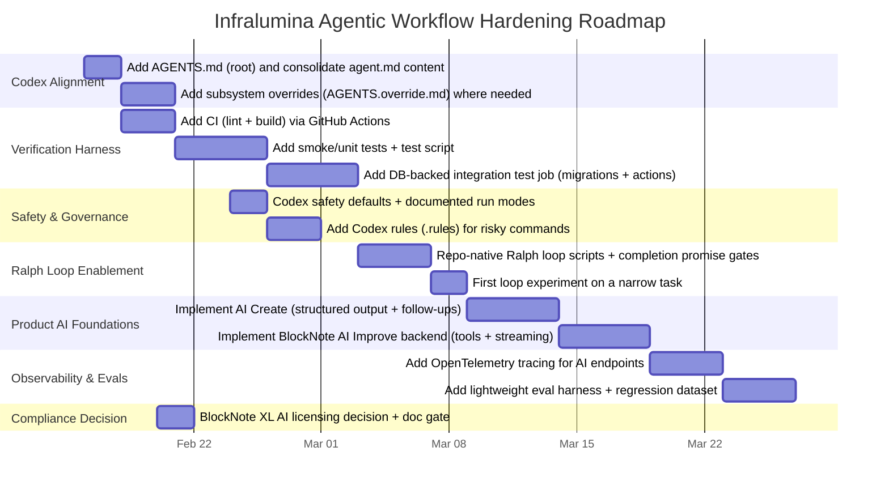

# Infralumina vs. Current Best Practices for Fully Agentic AI Coding Workflows

## Executive summary

Your repo already has several traits that are unusually “agent-ready” compared to typical early-stage apps: a clear product spec (`docs/prd.md`), a living, dependency-tracked implementation plan designed explicitly for parallel agent work (`docs/phase0-implementation-plan.md`), and a project-context file (`agent.md`) that encodes operational rules (branching discipline, definition-of-done, strict separation between structured DB writes and narrative document edits). citeturn4view0turn8view0turn8view1 This is broadly aligned with modern guidance that successful agentic systems favor simple, composable workflow patterns with explicit “ground truth” checks rather than opaque autonomy. citeturn26search0turn25view0

The biggest gap is *tool interoperability with Codex CLI specifically*: Codex persists repo instructions via `AGENTS.md` (and can scaffold it with `/init`), while your repository currently uses `agent.md` (lowercase) and has **no `AGENTS.md`**. That means Codex will not automatically load your repo’s persistent instructions in the intended way. citeturn23view1turn31view0turn4view0 In practice, this forces you into “manual prompting of conventions,” which is the opposite of best practice for fully agentic coding loops.

Second, you have **no automated verification harness** (tests + CI) yet: `package.json` has no `test` script, and the repository appears to have no GitHub Actions workflows configured. citeturn4view1turn11view0turn7view1 This is a structural blocker for Ralph-style continuous agent loops (or any reliable long-run autonomy), because the loop’s power comes from repeatedly applying changes until externally verifiable completion criteria are satisfied (tests, builds, lint, etc.). citeturn10search2turn25view1turn25view3

On safety and supply-chain hygiene, you’re ahead of many projects: you’re using Bun’s `trustedDependencies`/script-control mechanisms (and explicitly allow-listing packages like `sharp`)—a credible mitigation against arbitrary lifecycle scripts at install time. citeturn4view1turn20search0turn20search6 This aligns well with the “default-safe” posture expected for autonomous tooling.

Finally, there’s an important *license risk* to surface early: your PRD plans BlockNote AI (`@blocknote/xl-ai`), and BlockNote’s own docs/pricing state that XL packages (including AI) are copyleft (GPL-3.0) unless you obtain a commercial license—this can be incompatible with closed-source/internal proprietary deployment if you can’t comply with GPL terms. citeturn8view0turn22search0turn34view2

## Repo audit

### High-level structure and intent

The repo is a Next.js App Router application with a conventional split between `app/`, `components/`, `lib/`, and `docs/`, plus Supabase migrations and a Bun lockfile. citeturn7view1turn4view1 The documentation (PRD + phase plan + agent context) is unusually explicit and reads like a “spec-driven delivery contract” that a coding agent could follow. citeturn8view0turn8view1turn4view0

### Audit table

| Area | What’s in the repo now | Evidence | Observations vs agentic best practice |
|---|---|---|---|
| Repo layout | `app/`, `components/`, `lib/`, `docs/`, `supabase/migrations/`, `public/` | citeturn7view1 | Clean, predictable structure helps agent navigation and tool use. |
| Agent instructions | `agent.md` describes goal, workflow rules, scope, DoD | citeturn4view0 | Codex CLI expects `AGENTS.md` for persistent repo instructions; you currently do **not** have it. citeturn23view1turn31view0 |
| Spec & execution plan | `docs/prd.md`, `docs/phase0-implementation-plan.md` | citeturn8view0turn8view1 | Strong alignment with “workflow-first” agent design and parallelization lanes. citeturn26search0turn25view0 |
| Dependency management | `bun.lock`; package.json includes `ignoreScripts` + `trustedDependencies` | citeturn4view1 | Good supply-chain posture; matches Bun’s allow-list model for lifecycle scripts. citeturn20search0turn20search6 |
| App dependencies | Next.js, React, Supabase SSR/JS client, Drizzle ORM, BlockNote core/react/shadcn | citeturn4view1turn21view0 | Stack supports agent-friendly patterns (typed DB access, server actions, client-only editor isolation). |
| Auth & RBAC | Server-side role guards (`requireRole`, `canWriteIncidents`, `canManageUsers`) | citeturn13view0turn13view1turn12view6turn16view0 | Strong security baseline: authorization enforced server-side, not just UI hiding—explicitly called out as a principle. citeturn4view0turn8view0 |
| Data access | Mix of Supabase client (reads in pages) + Drizzle direct DB connection (writes via server actions) | citeturn12view4turn17view0turn19view0turn14view0 | Works, but increases the “policy split brain” risk (RLS vs direct DB). PRD explicitly defers RLS to later; acceptable for demo but should be treated as a hard boundary. citeturn8view0turn14view5 |
| Middleware/session refresh | `lib/supabase/middleware-client.ts` exists; root has `proxy.ts` with a middleware-like matcher | citeturn13view4turn4view4turn7view1 | Unclear how this is wired: no `middleware.ts` found at repo root (404 when fetched). Verify that Supabase session refresh actually runs. citeturn12view0turn4view4 |
| Tests | No `test` script; no testing deps visible | citeturn4view1 | Major blocker for agentic reliability and Ralph loops (needs objective completion checks). citeturn10search2turn25view1 |
| CI/CD | No `.github/` directory in root listing; Actions page shows “getting started” marketing state | citeturn7view1turn11view0 | No automated gatekeeping; makes autonomous changes riskier and slower to validate. |
| AI features | PRD + plan specify AI Create + AI Improve flows, but P0-08/P0-09 marked TODO | citeturn8view0turn8view1 | The design intent is good (structured extraction + editor-native tool calling), but execution is not present yet. |
| BlockNote AI licensing | PRD warns XL/dual licensing for AI | citeturn8view0 | BlockNote also states XL packages are GPL-3.0 or commercial for closed-source usage—needs early decision. citeturn22search0turn34view2 |

## Current best practices for fully agentic AI coding workflows

### Persistent agent instructions and configuration

For Codex CLI, persistent repository instructions are conventionally stored in `AGENTS.md`, and Codex can scaffold this via `/init`. citeturn23view1 Codex also supports hierarchical overrides (e.g., `AGENTS.override.md` close to a subsystem), and it stops searching once it reaches the current working directory—so placing overrides near specialized work is recommended. citeturn23view0

Separately, there’s a community push to standardize agent configuration via `AGENT.md` as a universal, tool-agnostic format (root + hierarchical overrides, optional file references). citeturn28view0 The best-practice synthesis here is pragmatic: **pick one canonical policy document and bridge to tool-specific conventions** so you don’t maintain divergent instruction sets.

### Loop design and Ralph-style continuous iteration

Agent loops are now typically treated as *tool-using loops with explicit stopping conditions and context management*. The AI SDK formalizes this as “LLMs that use tools in a loop,” emphasizing context management and stopping conditions as first-class. citeturn25view0turn25view1

Ralph Loop (a community technique) pushes this further by externalizing the loop: keep re-running the agent with the same prompt until an objective “done” condition is met, rather than trusting the model’s internal sense of completion. Vercel’s `ralph-loop-agent` describes it as repeatedly feeding the agent a task until it actually succeeds, echoing the “Ralph is a Bash loop” framing. citeturn10search2turn10search6 This idea is consistent with research patterns like ReAct (reasoning + acting with tool feedback) and Reflexion (learning from feedback via memory), but Ralph’s key contribution is operational: **completion must be externally verifiable**. citeturn27search0turn27search1turn10search2

### Orchestration and multi-agent pipelines

OpenAI’s recommended “production” path to multi-agent orchestration with Codex is to run Codex CLI as an MCP server and orchestrate it using the OpenAI Agents SDK, enabling multi-agent workflows with hand-offs and traceability. citeturn23view3turn23view4 MCP itself is an open protocol for integrating LLM applications with tools and context sources. citeturn27search3

This matters for your repo because your phase plan already models parallel “lanes” and dependencies (Foundation, RBAC/Admin, Incident Core, AI, Stabilization). citeturn8view1 That’s structurally similar to orchestrator-worker patterns described in modern agent workflow guidance—just currently expressed as a doc rather than an executable orchestrator. citeturn26search0turn25view0

### Safety, sandboxing, and command governance

Codex CLI exposes explicit safety controls: approval policies (`--ask-for-approval`) and sandbox policies (`--sandbox`), plus a “YOLO” mode that bypasses approvals and sandboxing and is explicitly warned as dangerous unless you have an externally hardened environment. citeturn24view0 Codex also provides an experimental rules system for controlling which commands can run outside the sandbox, using `.rules` files in a Starlark-based format. citeturn32search0turn32search1

On the supply-chain side, Bun’s trusted dependencies model is a concrete best practice for agentic workflows because agents will frequently install dependencies; restricting lifecycle scripts reduces the blast radius of compromised packages. citeturn20search0turn20search6

### Reproducibility, testing, and observability

A core best practice that shows up across tooling ecosystems is that agent autonomy must be paired with: reproducible environments, testable behaviors, and observable runs.

The AI SDK provides explicit support for non-deterministic testing via mock providers and test helpers. citeturn29search1 For observability, AI SDK telemetry is based on OpenTelemetry. citeturn29search0turn29search11 This is relevant both for your *product’s* AI features and for *agentic development workflows* (tracking agent actions, tool usage, cost, and failures).

For your planned editor AI features, BlockNote’s AI docs show a concrete “tools + streaming” backend pattern using the AI SDK, where BlockNote tool definitions are forwarded to the model and tool invocations are returned to the client; BlockNote also notes that by default it sends the entire chat history unless you implement a server persistence pattern. citeturn34view0turn34view1 This intersects directly with state management and cost control.

## Alignment and gaps

### Where your repo aligns strongly

Your docs and code emphasize “server-side authorization is the authority” and implement it accordingly via server actions + role checks, which is the correct security posture for any system that will later incorporate autonomous/agentic behaviors. citeturn4view0turn13view0turn17view0turn16view0 The Phase 0 plan also encodes the kind of explicit dependency graph and parallelization lanes that orchestrated multi-agent systems typically require. citeturn8view1turn23view3

On state management for the *product*, your incident document editor already implements robust “unsaved changes” handling (autosave, beforeunload guard, interception of internal navigation, explicit save-before-leave flow). citeturn16view3 That is exactly the kind of deterministic, user-auditable state discipline that pairs well with later AI-driven edits.

### Where your repo diverges from current best practice

The key divergences are mostly workflow infrastructure rather than application code:

| Best-practice dimension | Current repo pattern | Recommended pattern | Gap impact |
|---|---|---|---|
| Codex CLI instruction convention | `agent.md` exists citeturn4view0 | Use `AGENTS.md` (scaffoldable via `/init`) + optional overrides citeturn23view1turn23view0 | Codex won’t auto-load your rules; higher variance, more prompt overhead. citeturn31view0 |
| “Universal” agent config interoperability | No `AGENT.md` citeturn31view1 | Consider a canonical policy doc that can bridge to tool conventions (AGENT.md spec supports hierarchical overrides and file references) citeturn28view0 | Harder to reuse the same guardrails across multiple agent tools. |
| Objective completion criteria | No tests; no CI citeturn4view1turn11view0turn7view1 | Add automated checks so loops can terminate on truth (lint/typecheck/build/tests/e2e) citeturn25view1turn10search2 | Blocks reliable long-run autonomy; Ralph loops become expensive guesswork. |
| Codex safety governance | No repo-scoped `.codex/config.toml`; no rules file; `.gitignore` ignores `.codex/config.toml` citeturn9view3turn31view2 | Use Codex config layering (project overrides load when trusted) + approval/sandbox defaults; add `.rules` for command governance citeturn23view2turn24view0turn32search0 | Increased risk of unsafe commands or inconsistent safety posture across contributors/machines. |
| AI implementation readiness | AI flows specified, but P0-08/P0-09 TODO citeturn8view1turn12view4 | Implement structured extraction + follow-ups via AI SDK; implement BlockNote AI backend using tool definitions + streaming; add persistence to reduce context rot citeturn25view2turn34view0turn34view1 | Product AI isn’t yet measurable or testable; harder to evaluate improvements. |
| Observability | No OpenTelemetry instrumentation visible in repo | Instrument AI calls and agent actions with OpenTelemetry; AI SDK telemetry supports this citeturn29search0turn29search11 | No trace-level debugging for AI failures (hallucinations, tool misuse, latency). |
| License risk management | PRD notes licensing risk; no enforcement or decision doc | Decide whether you can comply with GPL-3.0 or need a commercial license; BlockNote XL AI is copyleft by default citeturn8view0turn22search0turn34view2 | Potentially high business/legal risk if this becomes production-facing. |

## Prioritized actionable recommendations

The recommendations below are ordered by “unlocks agentic reliability first” (Codex compatibility + verification harness), then “improves autonomy depth” (Ralph loops + orchestration), then “hardens AI product features” (observability + evals + safety).

| Priority | Recommendation | Why it matters for fully agentic workflows | Implementation sketch tailored to this repo |
|---|---|---|---|
| Highest | Add `AGENTS.md` (Codex-native) and move/merge the essential content from `agent.md` | Codex loads persistent repo guidance from `AGENTS.md`; `/init` scaffolds it. Without it, your conventions are not “sticky.” citeturn23view1turn31view0 | Create `AGENTS.md` at repo root that includes: build/lint commands, “server-side auth is authoritative,” doc pointers (`docs/prd.md`, `docs/phase0-implementation-plan.md`), and the strict separation principle (structured fields vs narrative doc edits). Use Codex’s override capability later (e.g., `app/AGENTS.override.md` for UI rules, `lib/AGENTS.override.md` for DB/auth rules). citeturn23view0turn8view0turn8view1 |
| Highest | Add a minimal CI workflow that runs lint + build (and later tests) on every PR | Autonomous coding loops need an objective “truth oracle.” GitHub Actions is the default CI/CD platform on GitHub. citeturn33search4turn11view0 | Add `.github/workflows/ci.yml` to run `bun install` (using `bun.lock`), then `bun run lint`, then a build command that is known to be stable in CI. Your plan notes Turbopack build issues in restricted environments, while webpack build succeeds—codify the known-good one. citeturn8view1turn4view1 |
| Highest | Introduce at least one automated test layer (start with “smoke” and then grow) | Ralph loops and long-running autonomy depend on tests passing as completion criteria. citeturn10search2turn25view1 | Add a `test` script and start with: (a) unit tests for auth/role guard functions and incident schema validation; (b) a “build-time” integration test that runs migrations against a disposable Postgres (container) and exercises a couple of server actions. Even a small harness is transformational for agentic reliability. |
| High | Make environment + toolchain reproducible for agents (pin Node/Bun; standardize scripts) | Agents run commands repeatedly; ambiguity causes drift. Your docs say “Bun standard,” but README quickstart uses npm. citeturn4view0turn4view2turn4view1 | Add a single authoritative “Local Dev / Agent Commands” section and align README + `AGENTS.md`. Consider adding `packageManager` in `package.json` and a `.tool-versions`/`.nvmrc`-equivalent convention so agents don’t guess. Keep `.env.example` but add “what is safe to commit.” citeturn4view5turn4view1 |
| High | Add Codex safety defaults and command governance using approvals + sandbox + rules | Codex exposes explicit safety controls (`--ask-for-approval`, sandbox modes, “yolo” warnings). Rules can restrict commands outside sandbox. citeturn24view0turn32search0turn32search9 | Create a documented “Codex profiles” setup: recommended flags for day-to-day (`--full-auto` is a bounded preset) and disallow casual use of `--yolo`. Add a rules file (Starlark) to require approval for network/publish commands (e.g., `gh`, `curl`, deployment). citeturn24view0turn32search0turn32search5 |
| Medium | Make Ralph loops “repo-native” via scripts + completion promises + CI gates | Ralph loops work best when the loop has a stable prompt, a progress file, and objective completion signals. citeturn10search2turn10search1 | Add `scripts/ralph/` with: `PROMPT.md` (“Implement P0-07…”), a `progress.md` append log, and a shell script that runs `codex exec` repeatedly until it sees a completion promise *and* CI checks pass locally (or at least lint/build). Use the phase plan as the work queue. citeturn8view1turn10search1turn32search5 |
| Medium | Implement AI Create (P0-08) + AI Improve (P0-09) using the documented AI SDK + BlockNote AI tool pattern | Best practice is: structured extraction for DB fields; tool-based edits for docs; follow-up for missing required fields. Your PRD already describes this. citeturn8view0turn4view0 | For AI Create: use AI SDK structured output + a Zod schema (your PRD includes a schema sketch). citeturn8view0turn25view2 For BlockNote AI: follow BlockNote’s backend integration pattern—forward tool definitions, set the system prompt, and stream tool calls/results, adding server persistence if you want to avoid sending full chat history each time. citeturn34view0turn34view1 |
| Medium | Add observability for AI (and later for agentic dev workflows): OpenTelemetry traces + “AI run IDs” | AI SDK telemetry is OpenTelemetry-based; this is the modern default for tracing and debugging agent systems. citeturn29search0turn29search11 | Instrument your AI endpoints (AI Create + BlockNote AI route) with OTel spans including: incident ID, user role, model/provider, token usage/cost, latency, and tool-call counts. Consider an observability backend compatible with AI SDK telemetry when you scale (Langfuse/Laminar/etc.). citeturn29search2turn29search0 |
| Medium | Decide and document BlockNote XL AI licensing posture now | BlockNote states XL packages (AI) are copyleft (GPL-3.0) unless you obtain a commercial license; PRD recognizes the risk. citeturn22search0turn34view2turn8view0 | Add `docs/licensing.md` with: whether you will comply with GPL-3.0 (open source the app) or procure a commercial license before any production usage. Gate merges that add `@blocknote/xl-ai` until this is resolved. |
| Lower | Build multi-agent orchestration when you truly need it (Agents SDK + Codex MCP server) | It enables deterministic, auditable pipelines with hand-offs and full traces, but it’s extra moving parts. citeturn23view3turn23view4 | Only after CI/tests exist: consider a small “release train” orchestrator that runs a reviewer agent (`/review` equivalent), a test-fixer agent, and a doc-updater agent. Keep it minimal; complexity should earn its keep. citeturn23view1turn23view3 |

### Architectural trade-offs to consider

Keeping your doc-driven phase plan as the “source of truth” (work queue) is a strong workflow pattern and maps cleanly to orchestrator-worker systems. citeturn8view1turn26search0 The trade-off is that doc state can drift unless you enforce updates in CI (e.g., requiring that each PR touches the relevant plan block). Given your explicit “update plan block after each feature” rule, that’s achievable. citeturn4view0turn8view1

Mixing Supabase queries (reads) with direct DB access via Drizzle (writes) is pragmatic, but it raises a long-term security/consistency question: once you introduce RLS later, the app can accidentally behave differently depending on which access path is used. This is fine for Phase 0 (as you explicitly state), but plan a deliberate unification strategy later rather than letting it become accidental architecture. citeturn8view0turn17view0turn12view4

## Validation experiments and metrics

These are designed to prove that changes improve *agentic throughput and correctness*, not just add process.

### Experiments that validate agentic workflow improvements

A/B the presence of `AGENTS.md` and “executable completion criteria” by running the same Codex tasks twice: once with a minimal `AGENTS.md` and once without. Use Codex’s non-interactive mode (`codex exec`) so you can script and compare results. citeturn23view1turn32search5turn24view0 Metrics: number of iterations to completion, number of human clarifications, and number of rework cycles after review.

Run a Ralph loop prototype on a narrow task (e.g., “add unit tests for role guards + make them pass”) and require a completion promise only when `lint + build + test` succeed. This directly tests whether your harness is sufficient for continuous autonomy. citeturn10search2turn25view1 Metrics: loop iterations, wall-clock time, failure stop reasons, and rate of “false complete” (promise emitted but checks fail).

### Experiments that validate product AI improvements

For AI Create (structured extraction): create a small “incident intake corpus” (10–30 representative past incident descriptions) and measure field extraction accuracy for required fields (`title`, `severity`) plus follow-up quality when fields are missing (does it ask only for missing required fields, as your PRD mandates). citeturn8view0turn4view0 Metrics: required-field completeness rate, follow-up turns per intake, and rate of hallucinated values (should be near-zero for required fields if you enforce structured output + follow-ups).

For BlockNote AI Improve: measure accept/reject ratio and edit quality. BlockNote exposes explicit accept/reject actions and supports streaming tool-driven edits. citeturn34view3turn34view0 Metrics: accept rate, average time-to-acceptable draft, number of retries, and token/cost per successful improvement. Add trace-level debugging via OpenTelemetry once stable. citeturn29search0turn29search11

## Delivery timeline

## References

OpenAI Codex documentation on `AGENTS.md`, including `/init` scaffolding and override behavior. citeturn23view1turn23view0

OpenAI Codex CLI reference for approvals, sandbox modes, and safety warnings. citeturn24view0

OpenAI guidance for multi-agent orchestration using Codex as an MCP server and the OpenAI Agents SDK (with traceability/auditability). citeturn23view3turn23view4

Codex configuration layering and trust model for project-scoped `.codex/config.toml`. citeturn23view2turn32search9

Codex rules / execpolicy mechanics (Starlark-based `.rules` files). citeturn32search0turn32search1

AI SDK definitions of agents (tool loops), loop control (stop conditions), and tool calling schema validation. citeturn25view0turn25view1turn25view2

AI SDK human-in-the-loop patterns and telemetry/observability via OpenTelemetry. citeturn25view4turn29search0turn29search11

AI SDK testing support via mock providers and test helpers. citeturn29search1

BlockNote AI documentation: AI uses Vercel AI SDK; backend integration pattern forwarding tool definitions; default full chat history behavior and server persistence pattern. citeturn34view0turn34view1turn34view2

BlockNote XL licensing: XL packages (including AI) are dual-licensed GPL-3.0 or require a commercial license for closed-source use. citeturn22search0turn22search2turn34view2

Bun documentation on `trustedDependencies` and lifecycle script allow-listing (supply-chain safety). citeturn20search0turn20search6

GitHub Actions and supply-chain hygiene docs (CI/CD platform overview, dependency caching, Dependabot, CodeQL). citeturn33search4turn33search1turn33search6turn33search11

Ralph loop sources (continuous iteration until verifiable completion). citeturn10search2turn10search6turn10search1

Research foundations for tool-using agents and feedback loops (ReAct, Reflexion, SWE-agent). citeturn27search0turn27search1turn27search2